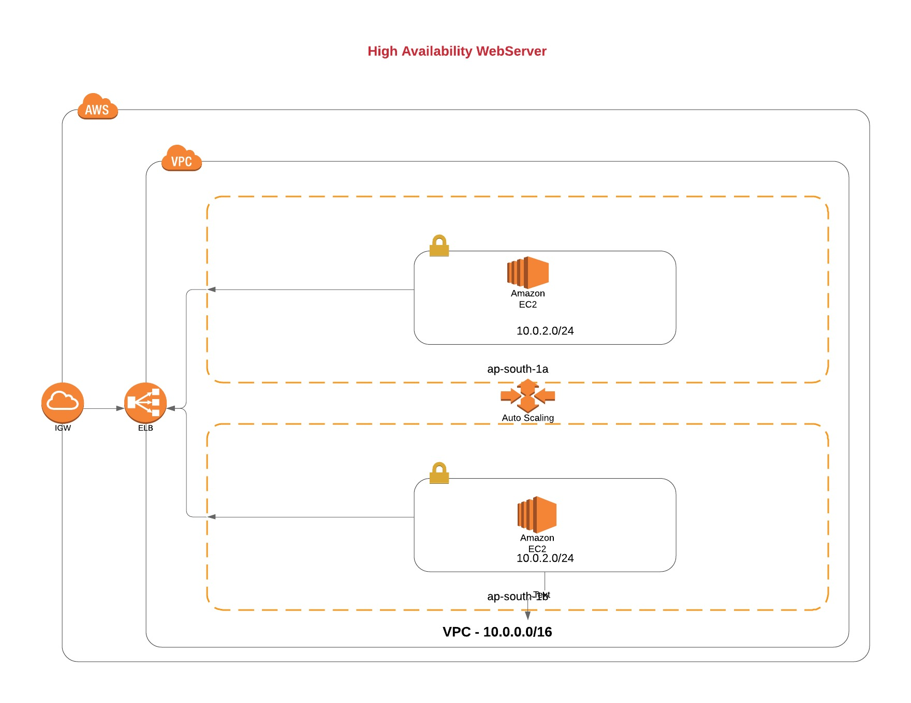

**Webserver - HA**

The terraform code will create an EC2 instance, which can be used as an webserver. This also has been configured with HA so there is no downtime required for any applications.

**Architecture Diagram**



**Execute ?**
create *terraform.tfvars* with your AWS *AWS_ACCESS_KEY= " "* and ** AWS_SECRET_KEY=" "* in this folder
create a pair of SSH key using *ssh-keygen -f mykey* 

finally, 

```
terraform init
terraform plan 
terraform apply
```
